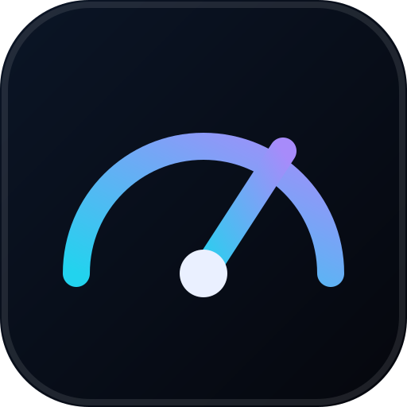

# NetGauge

**A glassy network monitor that lives in your Windows tray, plus a Speedtest-class web client.**

NetGauge is two front-ends on one shared measurement engine:

- **`apps/web`** — a fast, mobile-first speed-test website (Next.js). It hosts the speed API that both front-ends measure against, and it is where the desktop app is downloaded.
- **`apps/desktop`** — an Electron app for Windows (10/11) that puts a **live up/down meter in the system tray**, draws a translucent always-on-top widget using modern transparency (acrylic / mica on Windows 11), and bundles a full customisation studio: **12 typefaces, accent colours, glass depth, units, sampling rate** and more.

Both share **`packages/core`** — the speed-test engine, throughput math, OS counter parsers and the tray-icon rasterizer — so the numbers on the website and in the tray are computed by the same code.

<p align="center">
  
</p>

---

## Features

**Tray & widget (desktop)**
- Live ↓/↑ meters redrawn every sample, hover tooltip with exact rates, per-adapter selection.
- Tray icon is *rendered* from your current throughput and accent colour — no stale PNGs.
- Floating widget: always-on-top, click-through, draggable, remembers position, live sparkline.
- Acrylic / mica on Windows 11, transparent fallback elsewhere; opacity, blur, corner radius, film grain, glow.
- Customisation studio: theme, material, accent, type scale/weight/spacing, per-role fonts (12 bundled, offline).
- Behaviour: launch at login, start hidden, minimize-to-tray, "notify when slow" balloon.

**Speed test (web + desktop)**
- Six parallel streams, incompressible payloads, TCP slow-start discarded, log-scaled gauge.
- Ping = best of nine probes, plus jitter and loss; live sparkline; results stay on-device.
- The desktop app can point at any NetGauge speed server (CORS-enabled), defaulting to the public one.

**Website**
- Mobile-first, glassmorphism, self-hosted variable fonts (Inter / Space Grotesk / JetBrains Mono).
- Downloads page with platform detection and per-release assets from GitHub (graceful fallback).

---

## Quick start

```bash
npm install                # workspaces: core + web + desktop

# Website (Next.js + Turbopack dev server)
npm run dev:web            # http://localhost:3000

# Desktop app (Electron; needs a display + network for the Electron binary)
npm run dev:app

# Desktop renderer alone, in a browser (simulated feed, real speed test via proxy)
npm run dev:renderer       # http://localhost:5173

# Tests (hermetic) + live API E2E
npm test
npm run start:web &
NETGAUGE_E2E_URL=http://127.0.0.1:3000 npm test
```

## Build & release

```bash
npm run build              # web + desktop bundles
npm run icons              # regenerate icon.ico / icon.png from the SVG mark
npm run dist:win           # NSIS installer + portable exe -> apps/desktop/release
```

The installer publishes to GitHub Releases; the website's `/download` page reads
`/api/releases`, which lists those assets (or falls back to the conventional names).

> Note: packaging for Windows requires network access to GitHub (Electron + NSIS
> artifacts). See `docs/QA_REPORT.md` §6.

## Repository layout

```
packages/core     shared engine: speedtest, stats, iface parsers, tray raster, formatting
apps/web          Next.js speed-test site + /api/speed/* + /api/releases + /download
apps/desktop      Electron main/preload + React renderer (Studio + Widget)
scripts/          icon generation
docs/             ARCHITECTURE.md, QA_REPORT.md
```

## Docs

- [Architecture](docs/ARCHITECTURE.md) — how the pieces fit and where the numbers come from.
- [QA report](docs/QA_REPORT.md) — what was tested, results, and defects fixed.

MIT © NetGauge contributors.
